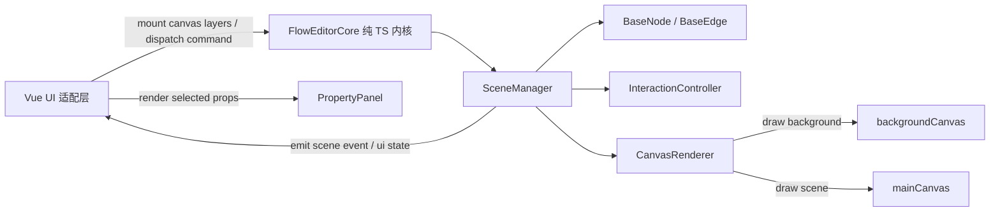

# Web 流程图工具架构设计

## 1. 项目目标

基于当前 Vite + Vue 3 + TypeScript 项目，实现一个 Web 版流程图编辑工具。核心交互包括：

- 左侧元素列表：展示可拖拽的流程元素模板。
- 中间 Canvas 操作区：承载元素创建、移动、选中、删除、端口命中和连线绘制。
- 右侧属性面板：展示并编辑当前选中元素或连线的属性。
- 拖拽创建：从元素列表拖拽元素到画布后，立即创建对应元素。
- 元素操作：画布内元素支持拖拽移动、选中和删除。
- 端口连线：每个元素自带端口，不同元素的端口之间可以创建连线。

当前阶段建议先实现“单画布、基础元素、基础连线、属性编辑”的 MVP，再扩展缩放、吸附、框选、撤销重做、复制粘贴和持久化。

## 2. 技术选型

| 类型 | 方案 | 说明 |
| --- | --- | --- |
| 前端框架 | Vue 3 | 只负责页面布局、面板渲染、生命周期挂载和事件适配 |
| 构建工具 | Vite | 沿用当前项目初始化配置 |
| 核心语言 | TypeScript | 流程图核心逻辑全部使用纯 TS 实现，避免依赖 Vue |
| 绘制技术 | HTML Canvas 2D | 所有画布元素、端口、连线由 Canvas 统一绘制 |
| 状态管理 | 纯 TS SceneManager | Vue 不直接管理流程图业务状态，只订阅核心增量事件和轻量 UI 状态 |
| 样式 | SFC scoped CSS + 全局基础样式 | 布局样式留在组件，设计变量放全局 |

不建议在第一阶段引入图编辑库。当前需求的核心价值是自定义 Canvas 编辑器，先沉淀自己的数据模型、命中测试和交互状态更合适。

## 3. 架构原则

本项目建议采用“框架无关编辑器内核 + Vue 适配层”的架构。

核心原则：

- 流程图核心逻辑不得依赖 Vue、DOM 组件、响应式 API 或路由。
- `SceneManager`、节点、连线、渲染器、命中测试、交互控制器全部使用纯 TypeScript class 或纯函数实现。
- Vue 只负责三栏布局、属性表单、按钮、拖拽入口、Canvas DOM 挂载和实例生命周期。
- 核心状态通过可序列化 DTO 导入导出，class 实例只作为运行时行为封装。
- 内核通过增量事件通知 UI 更新；完整 `FlowDocument` 只在保存、导出、加载等低频场景显式生成，避免把 Vue 响应式系统耦合进编辑器模型。
- 后续如果需要支持 React、Svelte 或原生 JS，只需要重写 UI 适配层，不改核心内核。

## 4. 总体架构



分层说明：

- UI 适配层：Vue 组件，负责用户界面和 DOM 生命周期。
- 编辑器内核：纯 TS 模块，对外暴露初始化、销毁、命令调用和事件订阅 API。
- 场景管理层：管理节点、连线、选中态、视口、命中测试和渲染调度。
- 元素模型层：每种元素可以是独立 class，封装绘制、端口、命中、序列化等行为。
- 数据层：使用 DTO 保存和加载流程图，不直接保存 class 实例。

## 5. 推荐目录结构

```text
src/
  App.vue
  main.ts
  style.css
  core/
    flow/
      FlowEditorCore.ts
      scene/
        SceneManager.ts
        SceneEvents.ts
        Box.ts
        RootBox.ts
        EdgeLayer.ts
      elements/
        BaseNode.ts
        StartNode.ts
        TaskNode.ts
        DecisionNode.ts
        BaseEdge.ts
        BezierEdge.ts
        ElementRegistry.ts
      views/
        BaseBoxView.ts
        GroupBoxView.ts
        BaseNodeView.ts
        StartNodeView.ts
        TaskNodeView.ts
        DecisionNodeView.ts
        BaseEdgeView.ts
        BezierEdgeView.ts
      renderer/
        CanvasRenderer.ts
        CanvasLayerManager.ts
        drawBackground.ts
        drawPorts.ts
      interaction/
        InteractionController.ts
        InteractionTypes.ts
        NodeDragInteraction.ts
        SelectionBoxInteraction.ts
        ViewportInteraction.ts
        ConnectPortsHandler.ts
      viewport/
        Viewport.ts
        CoordinateTransformer.ts
      types/
        flow.ts
        events.ts
        commands.ts
      utils/
        geometry.ts
        ids.ts
        serialization.ts
      constants/
        elementTemplates.ts
  features/
    flow-editor/
      components/
        FlowEditor.vue
        ElementPalette.vue
        FlowCanvas.vue
        PropertyPanel.vue
        CanvasToolbar.vue
      composables/
        useFlowEditorCore.ts
```

组件职责：

| 组件 | 职责 |
| --- | --- |
| `FlowEditor.vue` | 流程图编辑器容器，组织左中右三栏布局，创建并下发编辑器上下文 |
| `ElementPalette.vue` | 展示可拖拽元素模板，发起拖拽创建 |
| `FlowCanvas.vue` | 管理双 Canvas DOM、尺寸监听、鼠标事件、键盘事件绑定 |
| `PropertyPanel.vue` | 根据当前选中对象展示属性表单，提交属性更新事件 |
| `CanvasToolbar.vue` | 提供删除、缩放、适配画布、导入导出等工具按钮 |

核心 class 职责：

| Class | 职责 |
| --- | --- |
| `FlowEditorCore` | 编辑器门面，负责连接 Canvas 图层、场景管理器、渲染器和交互控制器 |
| `SceneManager` | 管理根容器、连线层、选中态、视口、命令执行和事件通知 |
| `Box` | 场景层级容器，负责管理子节点或子容器、边界计算、批量移动和序列化 |
| `RootBox` | 根场景容器，承载所有顶层节点和顶层容器 |
| `EdgeLayer` | 连线层，独立管理所有连线，避免跨 Box 连线被层级结构限制 |
| `BaseBoxView` | 所有容器视图的抽象基类，定义容器背景、边框、标题和视觉命中 |
| `BaseNode` | 所有节点的抽象基类，定义数据访问、端口、业务规则、移动和序列化协议 |
| `BaseNodeView` | 所有节点视图的抽象基类，定义 Canvas 绘制、视觉命中和端口视觉位置 |
| `BaseEdge` | 所有连线的抽象基类，定义端点、业务规则和序列化协议 |
| `BaseEdgeView` | 所有连线视图的抽象基类，定义 Canvas 绘制和视觉命中 |
| `CanvasRenderer` | 根据 `SceneManager` 的运行时对象和对应 View 分层绘制 Canvas |
| `CanvasLayerManager` | 管理 `backgroundCanvas`、`mainCanvas` 的上下文、尺寸、像素比和清屏 |
| `InteractionController` | 把 PointerEvent、KeyboardEvent、DragEvent 转换为场景命令 |
| `ElementRegistry` | 根据 `type` 创建对应节点 class，并查询对应节点 View |
| `CoordinateTransformer` | 负责 client、canvas、world 坐标转换 |

Vue Composable 只保留适配职责：

| Composable | 职责 |
| --- | --- |
| `useFlowEditorCore` | 在 Vue 生命周期中创建和销毁 `FlowEditorCore`，订阅内核事件并暴露 UI 需要的快照 |

## 6. 核心数据模型

建议把流程图状态设计为可序列化的纯数据结构，便于后续保存、导入导出、撤销重做和服务端同步。

```ts
export type NodeId = string
export type PortId = string
export type EdgeId = string

export interface Point {
  x: number
  y: number
}

export interface Size {
  width: number
  height: number
}

export interface ElementTemplate {
  type: string
  label: string
  defaultSize: Size
  ports: PortTemplate[]
  defaultProps?: Record<string, unknown>
}

export interface PortTemplate {
  id: string
  label: string
  offset: Point
}

export interface FlowNode {
  id: NodeId
  type: string
  label: string
  position: Point
  size: Size
  ports: FlowPort[]
  props: Record<string, unknown>
}

export interface FlowPort {
  id: PortId
  nodeId: NodeId
  templateId: string
  label: string
  offset: Point
}

export interface FlowEdge {
  id: EdgeId
  source: Endpoint
  target: Endpoint
  label?: string
  props?: Record<string, unknown>
}

export interface Endpoint {
  nodeId: NodeId
  portId: PortId
}

export type SelectableRef =
  | { type: 'node'; id: NodeId }
  | { type: 'edge'; id: EdgeId }
  | { type: 'box'; id: BoxId }

export interface SelectionState {
  items: SelectableRef[]
  primary: SelectableRef | null
}

export type BoxId = string

export type SceneElementData = FlowNode | BoxData

export interface BoxData {
  id: BoxId
  type: 'root' | 'group' | 'swimlane' | 'subflow'
  label?: string
  position: Point
  size: Size
  children: SceneElementData[]
  props?: Record<string, unknown>
}

export interface FlowDocument {
  root: BoxData
  edges: FlowEdge[]
  viewport?: ViewportData
}

export interface ViewportData {
  x: number
  y: number
  zoom: number
}

export interface EditorUiState {
  selection: SelectionState
  hovered: SelectableRef | null
  viewport: ViewportData
  selectedNode: FlowNode | null
  summary: {
    nodeCount: number
    edgeCount: number
  }
}

export type SceneEvent =
  | { type: 'node-added'; node: FlowNode; selection: SelectionState }
  | { type: 'node-moved'; nodeId: NodeId; position: Point }
  | { type: 'nodes-moved'; moves: Array<{ nodeId: NodeId; position: Point }> }
  | { type: 'nodes-removed'; nodeIds: NodeId[]; removedEdgeCount: number }
  | { type: 'selection-changed'; selection: SelectionState; selectedNode: FlowNode | null }
  | { type: 'hover-changed'; hovered: SelectableRef | null }
  | { type: 'viewport-changed'; viewport: ViewportData }
  | { type: 'document-loaded'; uiState: EditorUiState }
```

关键约束：

- `FlowNode.position` 使用画布世界坐标，不使用浏览器屏幕坐标。
- `FlowPort.offset` 是相对节点左上角的偏移，绘制和命中时再换算为世界坐标。
- `FlowEdge` 只保存端点引用，不保存线段坐标。线段坐标由节点和端口位置实时计算。
- 节点和连线的业务属性统一放在 `props`，基础几何属性保持顶层字段。
- `FlowDocument.root` 保存节点和容器的层级结构，不再使用顶层扁平 `nodes` 数组。
- `FlowDocument` 用于保存、加载和导出，不保存运行时选中态、hover 态和交互态，也不作为高频 UI 更新载体。
- `SelectionState` 统一表达单选和多选；`primary` 用于属性面板展示主选中对象，`items` 用于高亮所有选中对象。
- `EditorUiState` 用于 Vue 展示，只包含选中态、hover 态、视口、当前主选中节点和摘要计数。
- `SceneEvent` 用于高频增量通知，节点移动、视口变化、选择变化等交互不应默认生成完整 `FlowDocument`。
- 连线仍然保存在 `FlowDocument.edges`，不放入 `BoxData.children`，避免跨容器连线被层级归属限制。

## 7. 面向对象内核设计

流程图核心适合使用面向对象方式实现，但要区分“运行时对象”和“持久化数据”。

推荐模型：

```text
FlowNode DTO -> ElementRegistry -> BaseNode 实例
BaseNode 实例 -> serialize() -> FlowNode DTO
BaseNode 实例 + BaseNodeView + NodeDrawContext -> Canvas 绘制结果
```

### BaseNode 与 BaseNodeView 分层

建议把节点拆成两个运行时对象：

- `BaseNode`：节点模型层，负责普通逻辑，包括数据访问、端口定义、移动、属性更新、连接规则和序列化。
- `BaseNodeView`：节点视图层，负责 Canvas 绘制、视觉命中、端口视觉位置和不同交互状态下的展示。

这样做的目的不是增加抽象，而是避免节点模型直接依赖 Canvas。`BaseNode` 可以脱离浏览器单独测试，也更适合做保存、加载、撤销重做和服务端校验；`BaseNodeView` 专注视觉表现，后续可以替换主题、紧凑模式或调试模式。

节点基类不直接绘制：

```ts
export abstract class BaseNode {
  protected data: FlowNode

  constructor(data: FlowNode) {
    this.data = data
  }

  get id() {
    return this.data.id
  }

  get type() {
    return this.data.type
  }

  getPorts(): FlowPort[] {
    return this.data.ports
  }

  getPosition(): Point {
    return this.data.position
  }

  getSize(): Size {
    return this.data.size
  }

  getProps() {
    return this.data.props
  }

  moveTo(position: Point) {
    this.data.position = position
  }

  updateProps(props: Record<string, unknown>) {
    this.data.props = { ...this.data.props, ...props }
  }

  serialize(): FlowNode {
    return structuredClone(this.data)
  }
}
```

节点 View 基类负责绘制和视觉命中：

```ts
export interface NodeDrawContext {
  selected: boolean
  hovered: boolean
  dragging: boolean
  connecting: boolean
  disabled: boolean
  theme: FlowTheme
  viewport: ViewportData
}

export abstract class BaseNodeView<TNode extends BaseNode = BaseNode> {
  abstract draw(
    ctx: CanvasRenderingContext2D,
    node: TNode,
    context: NodeDrawContext,
  ): void

  hitTest(node: TNode, point: Point): boolean {
    const position = node.getPosition()
    const size = node.getSize()
    return point.x >= position.x
      && point.x <= position.x + size.width
      && point.y >= position.y
      && point.y <= position.y + size.height
  }

  hitTestPort(node: TNode, point: Point): FlowPort | null {
    return node.getPorts().find((port) => {
      const portPosition = this.getPortPosition(node, port)
      return distance(point, portPosition) <= 6
    }) ?? null
  }

  getPortPosition(node: TNode, port: FlowPort): Point {
    const position = node.getPosition()
    return {
      x: position.x + port.offset.x,
      y: position.y + port.offset.y,
    }
  }
}
```

普通矩形节点可以使用通用 View。菱形、圆形、特殊端口布局等视觉差异由子类覆盖：

```ts
export class DecisionNodeView extends BaseNodeView<DecisionNode> {
  draw(ctx: CanvasRenderingContext2D, node: DecisionNode, context: NodeDrawContext) {
    const strokeColor = context.selected
      ? context.theme.colors.selected
      : context.hovered
        ? context.theme.colors.hovered
        : context.theme.colors.border

    // 绘制菱形节点，业务状态从 node.getProps() 读取
    ctx.strokeStyle = strokeColor
  }

  hitTest(node: DecisionNode, point: Point): boolean {
    return hitTestDiamond(point, node.getPosition(), node.getSize())
  }
}
```

状态归属建议：

| 状态类型 | 归属 | 示例 |
| --- | --- | --- |
| 业务状态 | `BaseNode` / `props` | 审批状态、运行状态、校验错误、业务禁用 |
| 交互状态 | `SceneManager` / `InteractionController` | selected、hovered、dragging、connecting |
| 绘制上下文 | `NodeDrawContext` | theme、viewport、当前交互态组合结果 |

`BaseNodeView` 同时读取 `node` 和 `NodeDrawContext`，因此 hover 高亮、选中边框、拖动透明度、错误态、运行态都可以在 View 内自然处理，不需要让 `CanvasRenderer` 写大量类型判断。

元素注册表：

```ts
type NodeConstructor = new (data: FlowNode) => BaseNode
type NodeViewConstructor = new () => BaseNodeView

export class ElementRegistry {
  private nodeTypes = new Map<string, {
    node: NodeConstructor
    view: BaseNodeView
  }>()

  registerNode(type: string, options: {
    node: NodeConstructor
    view: NodeViewConstructor
  }) {
    this.nodeTypes.set(type, {
      node: options.node,
      view: new options.view(),
    })
  }

  createNode(data: FlowNode): BaseNode {
    const matched = this.nodeTypes.get(data.type)
    if (!matched) throw new Error(`Unknown node type: ${data.type}`)
    return new matched.node(data)
  }

  getNodeView(type: string): BaseNodeView {
    const matched = this.nodeTypes.get(type)
    if (!matched) throw new Error(`Unknown node type: ${type}`)
    return matched.view
  }
}
```

判断是否需要新 class 的标准：

- 只是颜色、尺寸、端口、标题不同：优先使用模板配置和 `TaskNode` 这类通用 class。
- 绘制形状、视觉命中、端口视觉位置明显不同：创建独立 `BaseNodeView` 子类。
- 连接规则、业务状态计算、属性约束明显不同：创建独立 `BaseNode` 子类。
- 节点内部有复杂运行时行为：创建独立 class。

### Box 场景层级容器

`SceneManager` 不直接管理节点集合，而是通过 `Box` 管理节点和容器层级。当前 MVP 可以只有一个 `RootBox`，后续增加 group、泳道、子流程、折叠容器时，可以在同一套结构上扩展。

推荐运行时结构：

```text
SceneManager
  ├─ rootBox: RootBox
  │   ├─ TaskNode
  │   ├─ DecisionNode
  │   └─ GroupBox
  │       ├─ TaskNode
  │       └─ TaskNode
  └─ edgeLayer: EdgeLayer
      ├─ BezierEdge
      └─ BezierEdge
```

`Box` 的职责是层级管理，不负责具体节点绘制，也不直接管理连线：

```ts
export type SceneElement = BaseNode | Box

export class Box {
  protected children: SceneElement[] = []

  constructor(protected data: BoxData) {}

  get id() {
    return this.data.id
  }

  add(child: SceneElement) {
    this.children.push(child)
  }

  remove(id: string): SceneElement | null {
    const index = this.children.findIndex(child => child.id === id)
    if (index >= 0) {
      return this.children.splice(index, 1)[0]
    }

    for (const child of this.children) {
      if (child instanceof Box) {
        const removed = child.remove(id)
        if (removed) return removed
      }
    }

    return null
  }

  find(id: string): SceneElement | null {
    for (const child of this.children) {
      if (child.id === id) return child
      if (child instanceof Box) {
        const matched = child.find(id)
        if (matched) return matched
      }
    }
    return null
  }

  findBox(id: BoxId): Box | null {
    const matched = this.find(id)
    return matched instanceof Box ? matched : null
  }

  getNodesDeep(): BaseNode[] {
    const nodes: BaseNode[] = []
    for (const child of this.children) {
      if (child instanceof Box) {
        nodes.push(...child.getNodesDeep())
      } else {
        nodes.push(child)
      }
    }
    return nodes
  }

  getBoxesDeep(): Box[] {
    const boxes: Box[] = []
    for (const child of this.children) {
      if (child instanceof Box) {
        boxes.push(child, ...child.getBoxesDeep())
      }
    }
    return boxes
  }

  moveBy(delta: Point) {
    for (const node of this.getNodesDeep()) {
      const position = node.getPosition()
      node.moveTo({
        x: position.x + delta.x,
        y: position.y + delta.y,
      })
    }
  }

  getBounds(): Rect {
    return getUnionBounds(this.children)
  }

  serialize(): BoxData {
    return {
      ...structuredClone(this.data),
      children: this.children.map(child => child.serialize()),
    }
  }
}
```

`EdgeLayer` 独立管理连线：

```ts
export class EdgeLayer {
  private edges = new Map<EdgeId, BaseEdge>()

  add(edge: BaseEdge) {
    this.edges.set(edge.id, edge)
  }

  remove(id: EdgeId) {
    this.edges.delete(id)
  }

  removeByNode(nodeId: NodeId) {
    for (const edge of this.edges.values()) {
      if (edge.hasEndpointNode(nodeId)) {
        this.edges.delete(edge.id)
      }
    }
  }

  getEdges() {
    return [...this.edges.values()]
  }

  serialize() {
    return this.getEdges().map(edge => edge.serialize())
  }
}
```

设计要点：

- `Box` 只负责层级、子元素管理、边界计算、批量移动和序列化。
- `Box` 不负责节点的具体绘制，容器自身如果需要边框或标题，后续增加 `BoxView`。
- 连线统一由 `EdgeLayer` 管理，避免跨 group、跨泳道、跨子流程时出现归属冲突。
- `SceneManager` 通过 `rootBox.getNodesDeep()` 获取所有节点，用于渲染、命中测试和导出。
- 当前 MVP 可以不暴露 group 功能，但底层先用 `RootBox` 承载节点，避免后续从扁平结构迁移。

## 8. 状态管理设计

状态由纯 TS `SceneManager` 管理，Vue 不直接持有流程图业务数组。高频交互使用 `SceneEvent` 增量通知，Vue 侧维护轻量 `EditorUiState`。完整 `FlowDocument` 只在保存、导出、加载和低频自动保存时显式生成。

```ts
export class SceneManager {
  private rootBox = new RootBox()
  private edgeLayer = new EdgeLayer()
  private selection: Selection = null
  private hovered: Selection = null
  private viewport: ViewportData = { x: 0, y: 0, zoom: 1 }
  private listeners = new Set<(event: SceneEvent) => void>()

  moveNode(id: NodeId, position: Point) {
    const node = this.rootBox.find(id)
    if (node instanceof BaseNode) {
      node.moveTo(position)
      this.emit({ type: 'node-moved', nodeId: id, position })
    }
  }

  select(selection: Selection) {
    this.selection = selection
    this.emit({
      type: 'selection-changed',
      selection,
      selectedNode: this.getSelectedNodeData(),
    })
  }

  setViewport(viewport: ViewportData) {
    this.viewport = { ...viewport }
    this.emit({ type: 'viewport-changed', viewport: this.viewport })
  }

  getUiState(): EditorUiState {
    return {
      selection: this.selection,
      hovered: this.hovered,
      viewport: this.viewport,
      selectedNode: this.getSelectedNodeData(),
      summary: this.getCanvasSummary(),
    }
  }

  toDocument(): FlowDocument {
    return {
      root: this.rootBox.serialize(),
      edges: this.edgeLayer.serialize(),
      viewport: this.viewport,
    }
  }

  subscribe(listener: (event: SceneEvent) => void) {
    this.listeners.add(listener)
    return () => this.listeners.delete(listener)
  }

  private emit(event: SceneEvent) {
    for (const listener of this.listeners) listener(event)
  }
}
```

设计要点：

- 对外不暴露 `Map` 的可变引用，外部只能通过命令方法修改场景。
- `SceneManager` 不直接维护节点集合，而是通过 `rootBox` 管理节点和容器层级。
- 连线放在独立 `edgeLayer`，不挂在某个 `Box` 下。
- Vue 通过 `subscribe` 获取 `SceneEvent`，不直接修改 class 内部状态。
- Vue 首屏或重载后通过 `getUiState()` 获取轻量 UI 状态，不默认获取完整 `FlowDocument`。
- 属性面板只接收当前选中节点 DTO，不直接改节点实例。
- 保存、导出和加载只走 `toDocument()` / `load()`；高频拖动、hover、缩放不调用 `toDocument()`。
- 后续撤销重做可以在命令层记录 `Command`，而不是依赖 Vue store。

Vue 适配层示例：

```ts
export function useFlowEditorCore() {
  const core = shallowRef<FlowEditorCore | null>(null)
  const uiState = shallowRef<EditorUiState | null>(null)

  function mount(options: {
    backgroundCanvas: HTMLCanvasElement
    mainCanvas: HTMLCanvasElement
  }) {
    core.value = new FlowEditorCore(options)
    uiState.value = core.value.scene.getUiState()
    return core.value.scene.subscribe(event => {
      uiState.value = applySceneEvent(uiState.value, event)
    })
  }

  return {
    core,
    uiState,
    mount,
  }
}
```

这里 Vue 只追踪 `uiState` 引用变化，不追踪节点 class 的内部字段，也不在高频交互中反复生成完整文档。

## 9. Canvas 渲染设计

Canvas 渲染采用双 Canvas 分层：

```text
FlowCanvas
  ├─ backgroundCanvas  背景色、网格线、静态参考线
  └─ mainCanvas        容器、连线、节点、端口、hover、selected、临时连线、框选
```

`backgroundCanvas` 负责低频绘制，只在尺寸、主题、viewport 变化时重绘。`mainCanvas` 负责高频绘制，在节点拖动、hover、选中、连线预览、场景数据变化时重绘。事件只绑定在 `mainCanvas`，`backgroundCanvas` 设置为不响应指针事件。

Canvas 渲染建议采用“状态驱动 + 手动重绘”的方式：

1. `SceneManager` 在命令执行后通知 `FlowEditorCore`。
2. 数据变化后调用 `requestAnimationFrame` 合并绘制。
3. `CanvasRenderer` 按变化类型决定重绘背景层、主绘制层或两者都重绘。
4. `CanvasRenderer` 从 `SceneManager` 读取运行时对象并绘制。

背景层绘制内容：

1. 背景网格。
2. 背景色。
3. 静态参考线。

主绘制层绘制顺序：

1. 已创建连线。
2. 连线中的临时预览线。
3. 容器背景和容器边框。
4. 节点主体和端口。
5. 框选范围、辅助线等全局覆盖层。

渲染模块示例职责：

```ts
interface CanvasLayers {
  background: HTMLCanvasElement
  main: HTMLCanvasElement
}

interface CanvasContexts {
  background: CanvasRenderingContext2D
  main: CanvasRenderingContext2D
}

interface RenderContext {
  contexts: CanvasContexts
  pixelRatio: number
  viewport: ViewportTransform
  scene: SceneManager
  interaction: CanvasInteractionState
}

class CanvasRenderer {
  constructor(private registry: ElementRegistry) {}

  renderBackground(context: RenderContext) {
    const ctx = context.contexts.background
    this.clearBackground(ctx)
    this.drawBackgroundGrid(ctx, context)
  }

  renderMain(context: RenderContext) {
    const ctx = context.contexts.main
    this.clearMain(ctx)
    this.drawEdges(context)
    this.drawPendingEdge(context)
    this.drawBoxes(context)
    this.drawNodes(context)
    this.drawOverlays(context)
  }

  private drawBoxes(context: RenderContext) {
    const ctx = context.contexts.main
    for (const box of context.scene.getBoxes()) {
      const boxView = this.registry.getBoxView(box.type)
      boxView.draw(ctx, box, this.createBoxDrawContext(box, context))
    }
  }

  private drawNodes(context: RenderContext) {
    const ctx = context.contexts.main
    for (const node of context.scene.getNodes()) {
      const nodeView = this.registry.getNodeView(node.type)
      nodeView.draw(ctx, node, this.createNodeDrawContext(node, context))
    }
  }

  private createNodeDrawContext(
    node: BaseNode,
    context: RenderContext,
  ): NodeDrawContext {
    return {
      selected: context.scene.isSelected({ type: 'node', id: node.id }),
      hovered: context.scene.isHovered({ type: 'node', id: node.id }),
      dragging: context.interaction.isDraggingNode(node.id),
      connecting: context.interaction.isConnecting(),
      disabled: false,
      theme: context.scene.getTheme(),
      viewport: context.viewport,
    }
  }
}
```

注意事项：

- 使用 `devicePixelRatio` 处理高清屏，避免 Canvas 模糊。
- 两张 Canvas DOM 尺寸变化时必须同步更新 CSS 尺寸、实际像素尺寸和 transform。
- 渲染函数保持纯绘制，不在绘制过程中修改流程图状态。
- `backgroundCanvas` 使用 `pointer-events: none`，`mainCanvas` 接收 pointer、drag、keyboard 相关事件。
- `CanvasRenderer` 只负责遍历和组装 `NodeDrawContext`，具体如何表现 hover、selected、业务错误态由 `BaseNodeView` 子类决定。
- 容器自身的绘制后续交给 `BoxView`，节点绘制仍然交给 `BaseNodeView`。
- 复杂节点暂时不要用 DOM 叠加，先保持 Canvas 双层渲染，避免 DOM 与 Canvas 坐标同步复杂化。

CSS 结构建议：

```css
.canvas-stage {
  position: relative;
  width: 100%;
  height: 100%;
}

.canvas-layer {
  position: absolute;
  inset: 0;
  width: 100%;
  height: 100%;
}

.canvas-background {
  pointer-events: none;
}

.canvas-main {
  pointer-events: auto;
}
```

## 10. 坐标系统

需要区分三类坐标：

| 坐标 | 来源 | 用途 |
| --- | --- | --- |
| Client 坐标 | 浏览器事件 `clientX/clientY` | 鼠标事件原始坐标 |
| Canvas 屏幕坐标 | 相对 `mainCanvas` 左上角 | 命中测试前的中间坐标 |
| 世界坐标 | 流程图内部坐标 | 节点位置、端口位置、连线计算 |

基础转换：

```ts
function clientToCanvas(event: PointerEvent, canvas: HTMLCanvasElement): Point {
  const rect = canvas.getBoundingClientRect()
  return {
    x: event.clientX - rect.left,
    y: event.clientY - rect.top,
  }
}

function canvasToWorld(point: Point, viewport: ViewportTransform): Point {
  return {
    x: (point.x - viewport.x) / viewport.zoom,
    y: (point.y - viewport.y) / viewport.zoom,
  }
}
```

即使 MVP 暂时不做缩放和平移，也建议从第一版开始保留 `viewport`，避免后续重构全部交互代码。

双 Canvas 下，坐标转换统一以 `mainCanvas` 为准。`backgroundCanvas` 只参与绘制，不参与事件命中；两张 Canvas 必须共享同一个 `viewport` 和像素比。

## 11. 交互状态机

Canvas 交互建议封装到纯 TS `InteractionController`，内部使用明确状态，而不是散落多个布尔值。

```ts
type CanvasMode =
  | { type: 'idle' }
  | { type: 'dragging-node'; nodeId: NodeId; start: Point; origins: Array<{ nodeId: NodeId; origin: Point }> }
  | { type: 'connecting'; source: Endpoint; current: Point }
  | { type: 'panning'; start: Point; origin: Point }
  | { type: 'selecting'; start: Point; current: Point }
```

基础事件流程：

| 事件 | 处理逻辑 |
| --- | --- |
| `pointerdown` | 命中端口则进入连线状态，命中节点则选中并进入拖动状态，右键进入平移状态，左键空白记录框选起点 |
| `pointermove` | 拖动节点时更新节点位置，连线状态下更新预览线终点，框选状态下更新临时选择框 |
| `pointerup` | 拖动节点时结束拖动，连线状态下检查目标端口并创建连线，框选状态下根据矩形选择节点 |
| `keydown Delete` | 删除当前选中节点或连线 |
| `dragover/drop` | 接收左侧元素模板，在 drop 坐标创建新节点 |

连线规则：

- 任意端口都可以作为连线起点或终点。
- 不能连接到同一个端口本身。
- 默认不允许重复连线，除非业务明确需要。
- 连线创建前使用 `canConnect(source, target, document)` 做统一校验。

删除规则：

- 删除节点时，同步删除与该节点相关的所有连线。
- 删除连线时，只删除连线本身，不影响节点。
- 删除后清空选中态。

框选规则：

- 左键在空白画布按下并移动超过阈值后进入框选状态。
- 框选矩形使用世界坐标，绘制时交给 `CanvasRenderer` 作为 overlay 绘制。
- 框选结束时调用 `SceneManager.selectNodesInRect(rect)`，只在结束时发 `selection-changed` 事件。
- 属性面板在多选时展示“已选择 N 个元素”，不展示单个节点属性。

点击多选规则：

- 普通左键点击未选中节点时替换当前选择，并保留节点拖拽能力。
- 普通左键点击已选中节点时保留当前选择集合，只把该节点作为主选中目标。
- `Shift + 左键点击节点` 调用 `SceneManager.addSelection(item)`，只把节点追加进当前选择，不进入节点拖拽。
- `Ctrl/Meta + 左键点击节点` 调用 `SceneManager.toggleSelection(item)`，对节点做选中/取消选中切换，不进入节点拖拽。
- 空白画布拖拽框选不响应 `Shift`、`Ctrl` 或 `Meta` 的连选/反选语义，始终替换当前选择。

多选拖拽规则：

- 拖动未选中节点时，先替换当前选择为该节点，再只移动该节点。
- 拖动已选中节点时，保留当前选择集合，并移动所有已选中的节点。
- 拖拽状态记录每个被拖节点的原始位置，移动时根据本次拖拽位移计算目标位置。
- 批量移动通过 `SceneManager.moveNodes(moves)` 执行，并发出 `nodes-moved` 增量事件。
- 选中两个及以上节点时，由 `SceneManager` 派生选中节点整体包围盒，`CanvasRenderer` 作为 overlay 绘制线框；该线框只表达当前交互态，不写入持久化数据。

吸附对齐规则：

- 吸附属于拖拽过程中的临时交互能力，不写入 `FlowDocument`、节点 DTO 或持久化数据。
- 吸附计算放在纯 TypeScript 的 `SnapEngine` 中，输入拖拽包围盒、其它节点矩形和阈值，输出位置修正量与辅助线。
- 单选拖拽使用当前节点矩形做吸附，多选拖拽使用选中节点整体包围盒做吸附，修正量统一应用到所有被拖节点。
- 第一版只支持节点边线和中心线吸附；网格、容器和端口吸附作为后续扩展。
- 吸附辅助线属于 `InteractionController` 维护的交互态，由 `CanvasRenderer` 作为 overlay 绘制，不参与场景序列化。

## 12. 拖拽创建设计

左侧元素列表使用浏览器原生 Drag and Drop 即可满足 MVP：

1. `ElementPalette` 在 `dragstart` 中写入模板 `type`。
2. `FlowCanvas` 在 `dragover` 中阻止默认行为，允许 drop。
3. `FlowCanvas` 把 `drop` 事件传给 `FlowEditorCore.handleDrop()`。
4. 将 drop 的 client 坐标转换为世界坐标。
5. `SceneManager` 根据模板和 `ElementRegistry` 创建节点实例。
6. 新节点默认加入 `rootBox`；如果 drop 坐标位于某个可接收节点的 `Box` 内，则加入对应 `Box`。

建议模板常量集中维护：

```ts
export const elementTemplates: ElementTemplate[] = [
  {
    type: 'start',
    label: '开始',
    defaultSize: { width: 120, height: 48 },
    ports: [
      { id: 'right', label: '右侧端口', offset: { x: 120, y: 24 } },
    ],
  },
  {
    type: 'task',
    label: '任务',
    defaultSize: { width: 160, height: 72 },
    ports: [
      { id: 'left', label: '左侧端口', offset: { x: 0, y: 36 } },
      { id: 'right', label: '右侧端口', offset: { x: 160, y: 36 } },
    ],
  },
]
```

## 13. 命中测试设计

命中测试统一放在 `SceneManager`、`BaseNodeView` / `BaseEdgeView` 和 `utils/geometry.ts` 中，避免事件代码和绘制代码重复计算。

命中优先级建议：

1. 端口。
2. 节点。
3. 容器。
4. 连线。
5. 空白画布。

原因是端口通常位于节点边缘，如果先命中节点，会导致用户难以发起连线。

基础函数：

```ts
function hitTestPort(
  point: Point,
  nodes: Iterable<BaseNode>,
  registry: ElementRegistry,
): HitPortResult | null

function hitTestNode(
  point: Point,
  nodes: Iterable<BaseNode>,
  registry: ElementRegistry,
): HitNodeResult | null

function hitTestEdge(
  point: Point,
  edges: Iterable<BaseEdge>,
  registry: ElementRegistry,
): HitEdgeResult | null
```

节点命中和端口命中委托给对应 `BaseNodeView`，这样菱形、圆形、特殊端口布局都能和绘制逻辑保持一致。连线默认使用正交线算法计算折点，并用“点到线段距离”完成命中测试；贝塞尔曲线绘制和采样命中保留为备用实现，由 `BaseEdgeView` 或后续专门的 EdgeView 选择使用。

容器命中应从深层到浅层检测，避免点击 group 内节点时先命中外层 group。框选或拖动 group 时，可以在未命中节点和端口后再命中 `BoxView`。

## 14. 属性面板设计

属性面板根据选中对象类型渲染不同表单：

| 选中对象 | 面板内容 |
| --- | --- |
| 无选中 | 显示空状态或画布信息 |
| 节点 | 节点名称、类型、位置、尺寸、业务属性 |
| 容器 | 容器名称、类型、位置、尺寸、业务属性 |
| 连线 | 连线名称、起点、终点、业务属性 |

数据流：

```text
SceneManager event -> Vue shallowRef<EditorUiState> -> PropertyPanel props
PropertyPanel emit update -> FlowEditorCore command -> SceneManager
```

建议：

- 面板表单使用本地草稿状态，输入后提交给 `FlowEditorCore`。
- 对位置、尺寸这类基础字段提供单独 action，不混入 `props`。
- 属性字段可以先手写，后续再根据 `ElementTemplate` 增加动态表单 schema。

## 15. 组件数据流

推荐数据流如下：

```text
FlowEditor
  ├─ useFlowEditorCore
  │   └─ 持有 FlowEditorCore 实例和 EditorUiState
  ├─ ElementPalette
  │   └─ 输出拖拽模板 type
  ├─ FlowCanvas
  │   ├─ 挂载 backgroundCanvas / mainCanvas 到 FlowEditorCore
  │   └─ 把 DOM 事件转交给 FlowEditorCore
  └─ PropertyPanel
      ├─ 读取 EditorUiState 中的 selectedNode / selectedBox / selectedEdge
      └─ 调用 FlowEditorCore.updateNodeProps / updateBoxProps / updateEdgeProps
```

`FlowEditor` 可以作为组合层持有 `useFlowEditorCore()` 的返回值。Vue 组件之间仍然遵循 props down / events up，但流程图业务命令统一转发给纯 TS 内核。

## 16. 持久化与导入导出

第一阶段可以先提供本地 JSON 导入导出：

```ts
interface FlowExportFile {
  version: 1
  document: FlowDocument
  exportedAt: string
}
```

规则：

- 导出时不保存 `selection` 和临时交互态。
- 导入时校验 `version`，为后续数据迁移留空间。
- 所有节点、端口、连线 ID 必须稳定。
- 如果模板升级，已有节点不应因为模板变化而丢失端口和属性。
- `FlowDocument.root` 保存容器和节点层级，`FlowDocument.edges` 保存独立连线层。
- 导入后通过 `ElementRegistry` 把 DTO 重建为运行时 `Box`、`BaseNode`、`BaseEdge` 实例。

## 17. 性能设计

MVP 阶段节点数量较少时，完整重绘即可。后续节点数量上升后再逐步优化。

优先级建议：

1. 使用 `requestAnimationFrame` 合并重绘。
2. 拖动节点时只更新必要状态。
3. 命中测试优先从后往前检测节点，让视觉最上层节点优先命中。
4. 大规模节点后引入空间索引，例如网格索引或四叉树。
5. 静态背景网格可缓存到离屏 Canvas。

需要避免：

- 每次 `pointermove` 都触发大量 Vue 组件重渲染。
- 在 Canvas 绘制函数中创建过多临时对象。
- 把 Canvas 高频 hover 状态全部放入深层响应式对象。
- 让 Vue 响应式系统代理 `SceneManager`、`BaseNode`、`BaseEdge` 等 class 实例。

## 18. 开发里程碑

### 阶段一：基础编辑闭环

- 搭建左中右三栏布局。
- 定义流程图 DTO、元素模板和 `ElementRegistry`。
- 实现 `RootBox`、`EdgeLayer`、`SceneManager`、`BaseNode`、`BaseNodeView`、基础节点 class 和基础节点 View。
- 实现双 Canvas 自适应尺寸、背景层绘制和主层基础绘制。
- 支持从左侧拖拽模板到画布创建节点。
- 支持节点选中、拖动和删除。
- 支持右侧属性面板编辑节点名称。

### 阶段二：端口与连线

- 绘制节点端口。
- 实现端口命中测试。
- 支持从输出端口拖动到输入端口创建连线。
- 支持连线选中和删除。
- 增加连线规则校验。

### 阶段三：编辑器体验增强

- 画布缩放和平移。
- 背景网格和对齐辅助线。
- 基于 `Box` 增加 group、子流程或泳道容器。
- 框选、多选、复制粘贴。
- 撤销重做。
- JSON 导入导出。

### 阶段四：工程化增强

- 拆分渲染器单元测试。
- 增加几何计算和连线规则测试。
- 增加流程数据 schema 校验。
- 抽象元素模板 schema 和属性面板动态表单。
- 抽离 `core/flow` 为可复用包，验证脱离 Vue 后可单独运行。

## 19. 最小实现顺序建议

建议按下面顺序落地，避免一开始陷入复杂交互：

1. 建立 `core/flow` 和 `features/flow-editor` 目录。
2. 定义 DTO 类型、模板类型、事件类型和命令类型。
3. 实现 `Box`、`RootBox`、`EdgeLayer`、`BaseNode`、`BaseNodeView`、`TaskNode`、`TaskNodeView`、`BaseEdge`、`ElementRegistry`。
4. 实现 `SceneManager` 通过 `rootBox` 管理节点、通过 `edgeLayer` 管理连线，并提供快照订阅。
5. 实现 `CanvasLayerManager` 和双 Canvas 尺寸同步。
6. 实现 `CanvasRenderer` 通过 `ElementRegistry` 查询 View，并分别绘制背景层和主层。
7. 实现 Vue 三栏静态 UI 和 `useFlowEditorCore` 适配。
8. 实现从左侧拖拽创建节点。
9. 实现 `InteractionController` 的节点命中、选中和拖动。
10. 实现删除选中节点。
11. 实现端口绘制、端口命中和连线创建。
12. 实现属性面板编辑。

这样每一步都有可验证的界面结果，也方便后续逐步扩展。
